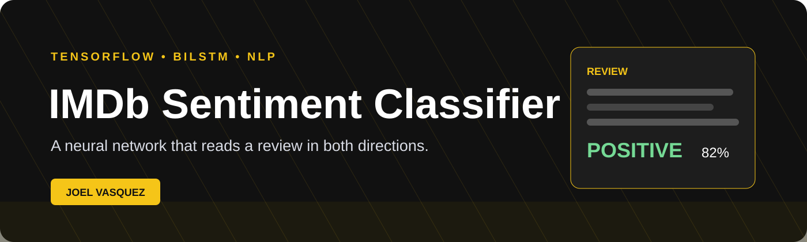
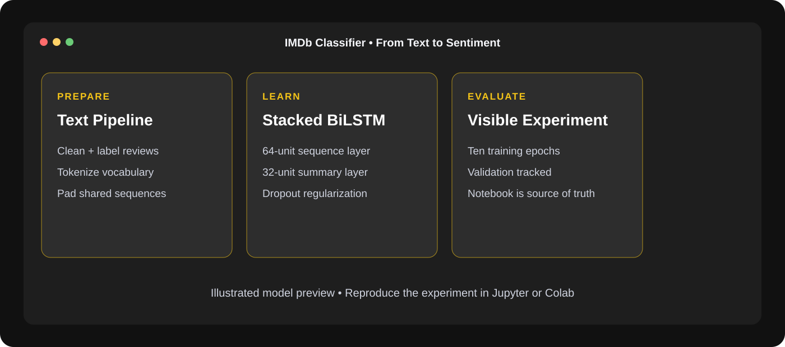

<div align="center">
  
</div>

<div align="center">

# IMDb Review Sentiment Classifier 🎬

**A neural network that reads a movie review in both directions before choosing a side.**

A notebook-based NLP project that trains stacked bidirectional LSTMs to classify
IMDb reviews as positive or negative.


</div>

---

<div align="center">
  
  <sub>Illustrated product preview based on implemented features.</sub>
</div>

---

## What it is

This project walks through an end-to-end binary sentiment classification
pipeline in a single reproducible notebook. Raw review text is cleaned,
tokenized, converted into padded integer sequences, and passed through a neural
network that learns sentiment from word order and surrounding context.

The repository keeps the experimentation visible. Model construction, training,
validation, and output live beside the preprocessing code instead of being
hidden behind a finished API.

## The model

```text
Tokenized review
      ↓
Embedding layer
      ↓
Bidirectional LSTM, 64 units, returns sequences
      ↓
Bidirectional LSTM, 32 units
      ↓
Dropout, 0.5
      ↓
Binary sentiment prediction
```

A normal recurrent layer reads from the first token to the last. A
bidirectional layer also processes the sequence in reverse, giving the model
access to context on both sides of a phrase. Stacking two layers lets the first
produce a richer sequence representation for the second to summarize.

## Pipeline

1. Load positive and negative IMDb review text.
2. Normalize and label the examples.
3. Build a vocabulary with Keras tokenization.
4. Convert reviews into integer sequences.
5. Pad or truncate sequences to a common length.
6. Train the stacked bidirectional LSTM for ten epochs.
7. Track training and validation behavior in the notebook.

## Honest results

The previous README listed several percentage improvements without including
the baseline experiment or measurement code required to verify them. Those
claims have been removed. The notebook is now the source of truth for model
configuration and results, which is healthier than résumé-metric fan fiction.

## Run it

### Google Colab

1. Open [`SentimentAnalysis.ipynb`](SentimentAnalysis.ipynb).
2. Choose **Open in Colab** from GitHub or upload the notebook to Colab.
3. Run the cells from top to bottom.

### Local Jupyter

```bash
git clone https://github.com/jguapp/IMDB-Reviews-Sentiment-Classifier.git
cd IMDB-Reviews-Sentiment-Classifier

python -m venv .venv
source .venv/bin/activate       # Windows: .venv\Scripts\activate
pip install jupyter tensorflow numpy
jupyter notebook SentimentAnalysis.ipynb
```

Training time depends heavily on whether TensorFlow can use a GPU.

## Repository

```text
.
├── README.md
└── SentimentAnalysis.ipynb   preprocessing, model, training, and evaluation
```

## Next steps

- Add a deterministic train/validation/test split
- Record a confusion matrix, precision, recall, and F1 score
- Compare against a TF-IDF logistic-regression baseline
- Save the tokenizer and trained model as versioned artifacts
- Add a small inference script or API
- Document the dataset source and exact preprocessing assumptions

---

<div align="center">
Built by <a href="https://github.com/jguapp">Joel Vasquez</a>
</div>

